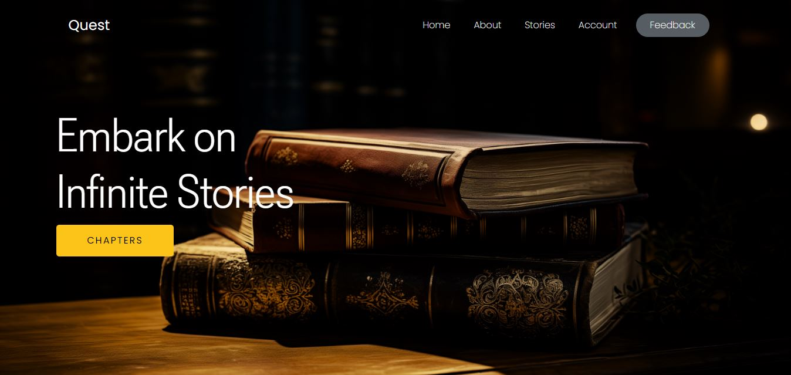

# The Quest: An Adventure of Infinite Stories



## Description
Embark on an extraordinary adventure with "The Quest," a captivating web experience that combines storytelling and interactive exploration. Join Kai and his friends in a tale of trials, discoveries, unity, and the transformative power of friendship. Dive into chapters, solve puzzles, and unravel the mysteries hidden in this vibrant and magical world.

## Features

- **Immersive Hero Section:** Capture attention with a visually stunning hero section.
- **Interactive Chapters:** Explore different chapters, each offering a unique adventure.
- **Visual Storytelling:** Engage users with visuals and compelling narratives.
- **Chapter Previews:** Provide a glimpse of each chapter, enticing users to explore further.
- **Engaging Account Section:** Allow users to register for more stories and updates.

## Technologies Used

- **HTML5**
- **CSS3**
- **Bootstrap 5**
- **Google Fonts**

# Application of choice

 ## VS-Code
 The entire application was designed using Visual Studio Code, a versatile source code editor known for its lightweight design and robust features.

 ## Useful Extensions

1. **Live Server**
   - **Extension:** [Live Server](https://marketplace.visualstudio.com/items?itemName=ritwickdey.LiveServer)
   - **Description:** Launches a development server and provides live reloading for your web projects.

2. **Bootstrap Icons**
   - **Extension:** [Bootstrap Icons](https://icons.getbootstrap.com/)
   - **Description:** Access a library of free, high-quality icons for use in your Bootstrap projects.

3. **Poppins, Roboto Flex, Seaweed Script Fonts**
   - **Extension:** [Google Fonts](https://fonts.google.com/)
   - **Description:** Enhance aesthetics with a combination of Poppins, Roboto Flex, and Seaweed Script fonts.

# Links
- Web Browser: [Download Google Chrome](https://www.google.com/chrome/)
- Figma Design: [View Figma Design](https://www.figma.com/file/IFJW9TqzqVdRxHZG7BuqLl/Quest?type=design&node-id=0%3A1&mode=design&t=PA4tCTeAwgPlATiZ-1)

# Setup

### Prerequisites
Ensure you have the latest version of Google Chrome installed for the optimal experience.

### Cloning the Repository
1. Clone the repository to your local machine:
   ```bash
   git clone https://github.com/saeedhalabi/Frontend-Learning-Project-2.git

### Navigate the Project Directory
<code>cd Frontend-Learning-Project-2</code>

### Running the project locally
1. Open the project folder in your preferred code editor
2. Locate the <code>index.html</code> file in your editor and open it with your web browser
3. Explore the Quest locally on your machine

# Learnings
Throughout the development of "The Quest", I gained valuable insights and skills in:

- HTML5 for structuring web content.
- CSS3 for styling and layout, creating a visually appealing user interface.
- Bootstrap 5 for responsive and consistent design elements.
- Working with CSS Grid.
- Google fonts integration for typography enhancements.
- Interactive storytelling techniques.

# Challenges Faced
- Crafting engaging and immersive visual elements.
- Ensuring responsiveness across various devices.
- Implementing CSS Grid.
- Implementing Bootstrap components for a seamless user experience.

Despite these challenges, each obstacle provided an opportunity for growth, skill development, and a deeper understanding of web development principles.

# Disclaimer
This project is designed to be responsive, providing an optimal viewing experience on various devices and screen sizes. Please feel free to explore Quest Unveiled on your preferred device.
